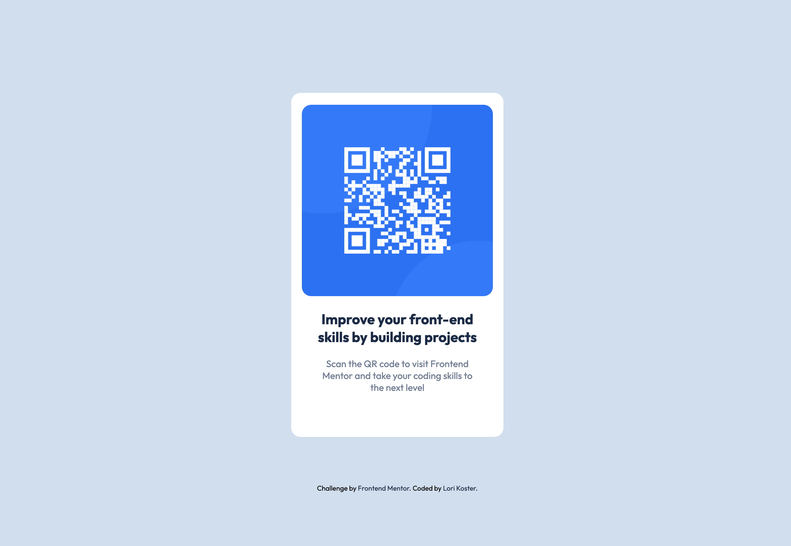

# Frontend Mentor - QR code component solution

This is a solution to the [QR code component challenge on Frontend Mentor](https://www.frontendmentor.io/challenges/qr-code-component-iux_sIO_H). Frontend Mentor challenges help you improve your coding skills by building realistic projects.

## Table of contents

- [Overview](#overview)
  - [Screenshot](#screenshot)
  - [Links](#links)
- [My process](#my-process)
  - [Built with](#built-with)
  - [What I learned](#what-i-learned)
  - [Continued development](#continued-development)
  - [Useful resources](#useful-resources)
- [Author](#author)

## Overview

### Screenshot

### Links

- Solution URL: [Code](https://github.com/lkoster/qr-code-component)
- Live Site URL: [Website](https://lkoster.github.io/qr-code-component/)

## My process

I start with mind mapping the layout of the site; what containers, flex or grid, divs required, classes needed. Once I have a good idea on how to tackle the project, I start writing the HTML using VSCode with Live Server or Preview so that I can see the progess as I go along. After all the content is done, I continue the process for the CSS styling. I try not to look at other people's challenge code for answers if I have a hang up, but instead google search what I am trying to accomplish. This method has helped me improve my skill and knowledge. After all is done and I am pleased with my results, I add everything here 😀.

### Built with

- Semantic HTML5 markup
- CSS custom properties
- CSS Flexbox
- Desktop-first workflow

### What I learned

I am fairly new to web development so this was a nice project to help me increase my comfort with flexbox.

### Continued development

I work with software developers so I see a lot of front end code. I am working towards mastering CSS and moving into learning more JavaScript.

### Useful resources

- [A Complete Guide to CSS Flex](https://css-tricks.com/snippets/css/a-guide-to-flexbox/) - CSS-TRICK's comprehensive guide to CSS flexbox layout. Very useful tool!

- [MDN Docs](https://developer.mozilla.org/en-US/) - If you are not using this resource, you need to start. Useful for everything!

## Author

- GitHub - [Lori Koster](https://github.com/lkoster)
- Frontend Mentor - [@lkoster](https://www.frontendmentor.io/profile/lkoster)
